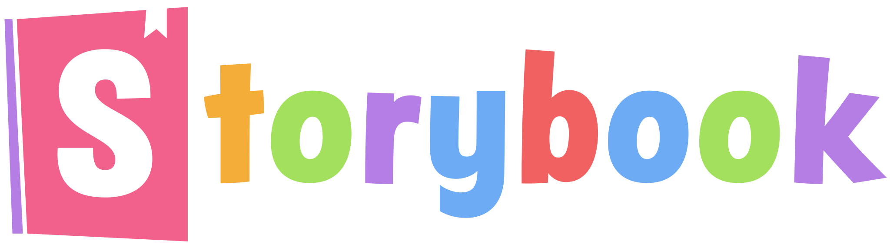

# 👋 Hi, I am Rushiraj

## 😎 About me:

1. A person with growth mindset.
1. Always looking to improve, becoming better at everything I do.
1. Love deep conversations.
1. Helping/Impacting as many lives as possible.
1. Honest, creative, caring

## 🔭 I’m currently working on:

1. Web and Desktop app developement

## 🌱 I’m currently learning

1. Detailed HTML CSS fundamentals
1. Javascript Core Concepts
1. Deep diving into ReactJS
1. NextJS

## 🥅 2021 Goals:

1. Daily algorithm practice
1. Get few certificates on FreeCodeCamp.org/Udemy/LinkedIn Learning
1. Learn Backend Technologies

## ⚡ Fun fact: I 💚 TREKKING 🏕️

### Lets Connect:

[][twitter]

[][linkedin]

### 🛠 Languages and Tools:

 &nbsp;
 &nbsp;
 &nbsp;
 &nbsp;
 &nbsp;
 &nbsp;
 &nbsp;
 &nbsp;
 &nbsp;
 &nbsp;
 &nbsp;
 &nbsp;
 &nbsp;
 &nbsp;
 &nbsp;

### Visitors

### Github Stats

  
Stats

  

[twitter]: https://twitter.com/Rushiraj004
[linkedin]: https://www.linkedin.com/in/rushiraj-brahmbhatt-12656864/
