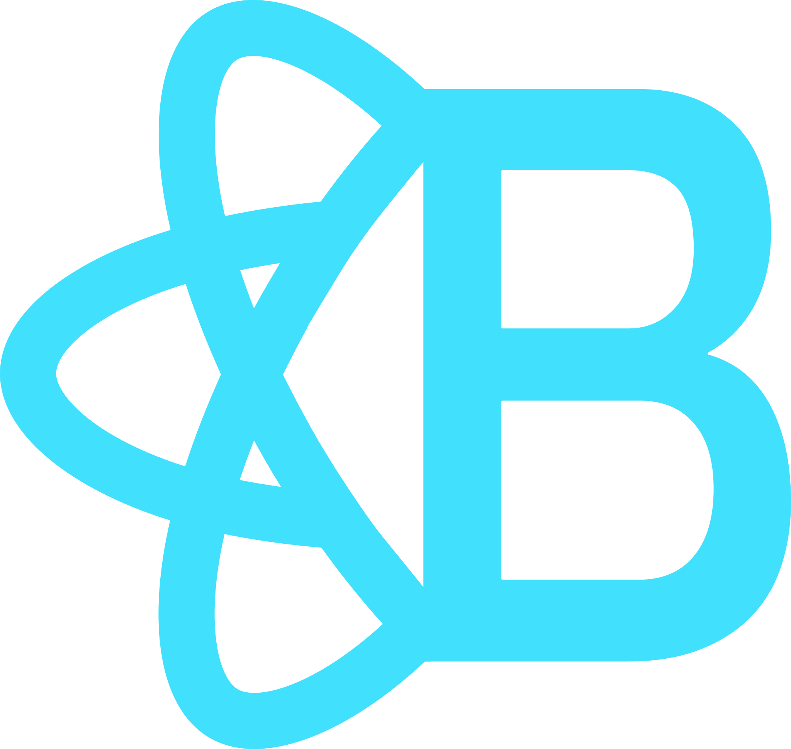

# Hey 👋, This is Rushiraj Brahmbhatt

Around 3.5+ years of experience in the computer software industry with a demonstrated history of working as web/frontend developer to analysis, design, development, and deployment, of various applications with a primary focus on technologies like HTML5, CSS3, CSS pre-processors like LESS and SASS, JavaScript, JS libraries like ReactJS and Redux. I am enthusiastic about learning new technologies to evolve and be a better self.

## 😎 About me

1. A person with growth mindset.
1. Always looking to improve, becoming better at everything I do.
1. Love deep conversations.
1. Helping/Impacting as many lives as possible.
1. Honest, creative, caring

### Check my [Resume](https://drive.google.com/file/d/1XNCEZReZAIvIbVUUIlaqFFZJ1CJkmPzf/view?usp=sharing)
### Check my [Profile](https://precious-lemming-590.notion.site/Rushiraj-Brahmbhatt-cbe4e37027c24a1698ebacb96c9367f7)

## 🔭 I’m currently working on

1. Web and Desktop app developement

## 🌱 I’m currently learning

1. Detailed HTML CSS fundamentals
1. Javascript Core Concepts
1. Deep diving into ReactJS
1. NextJS

## 🥅 2022 Goals

1. Daily algorithm practice
1. Get few certificates on FreeCodeCamp.org/Udemy/LinkedIn Learning
1. Learn Backend Technologies

### Lets Connect

 &nbsp;
 &nbsp;
 &nbsp;
 &nbsp;

 
 

### 🛠 Languages and Tools

 &nbsp;
 &nbsp;
 &nbsp;
 &nbsp;
 &nbsp;
 &nbsp;
 &nbsp;
 &nbsp;
 &nbsp;
 &nbsp;
 &nbsp;
 &nbsp;
 &nbsp;
 &nbsp;
 &nbsp;

 

## ⚡ Fun fact: I 💚 TREKKING 🏕️

### Visitors

## Some of my Github Stats

  

[twitter]: https://twitter.com/Rushiraj004
[linkedin]: https://www.linkedin.com/in/rushiraj-brahmbhatt-12656864/
